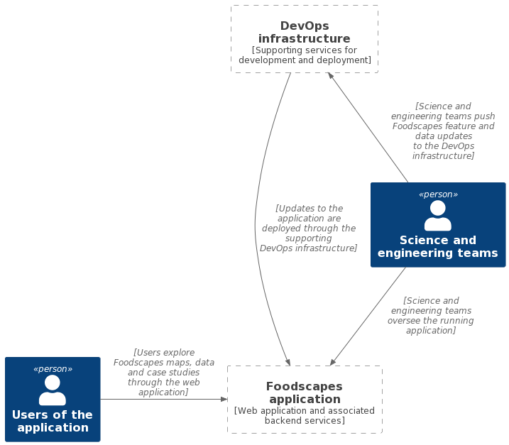
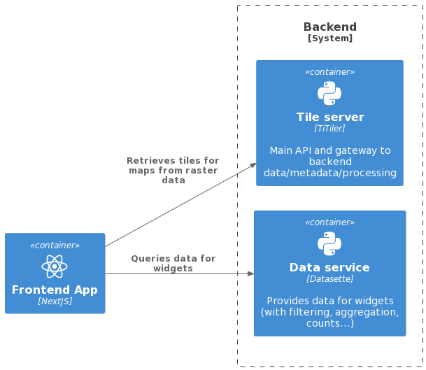

# Foodscapes application - architecture and operational overview

This document describes the current high-level architecture of the cloud
infrastructure for the Foodscapes application.

## Key principles and operational constraints

From an architectural standpoint, the key principles we follow are:

- Just enough complexity

We aim to balance complex requirements with the goal of keeping implementation
complexity to a suitable minimum.

For example, given the requirements and expected performance envelope for the
application, we identified the [baked
data](https://simonwillison.net/2021/Jul/28/baked-data/) architectural pattern
as a suitable way to colocate data and processing, using SQLite as backend data
layer, without the need to deploy and manage a client/server database server.

- Reliance on open source projects

Wherever possible, we rely on widely adopted open source projects and
components, such as the NextJS framework for the frontend application, the
SQLite-based Datasette framework to access data, the TiTiler tiler
application, and OCI/Docker containers for deployment.

Besides the operational leverage, these and other frameworks we choose should
also help both onboard developers to the project, as well as making it easier to
keep the application and its components running with minimal oversight over a
long timespan, relying on commodity cloud services such as AWS Fargate.

## System contexts

With reference to the [C4 model](https://c4model.com/), the current Foodscapes
architecture spans over two public key system contexts as well as two
operational context:

- End users of the application
- The Foodscapes application proper (frontend app and backend services)
- DevOps infrastructure (operational context: supporting services for
  development and deployment)
- Science and engineering teams (operational context)

These are shown here:

## Application components

With reference again to the C4 Model, the Foodscapes application is made up of
three containers (components), which all sit within the _Foodscapes application
proper_ context outlined in the previous section:

- The web application, which interfaces with
- The TiTiler tiler application
- The Datasette data API service

Their interaction is shown in the following diagram:

## Data layer

Data for Foodscapes maps and widgets is managed through lean backend services
hosted on Amazon AWS cloud services.

The [baked data](https://simonwillison.net/2021/Jul/28/baked-data/)
architectural pattern is employed throughout.

### Raster data

Raster data, as a single, multi-band Cloud-Optimized GeoTIFF (COG) file is
included in the OCI/Docker container for the TiTiler tiler service, rather than
being stored on separate cloud storage or in a cloud database.

Colocating raster data and raster computations (aggregation, filtering, etc.)
allows to minimise the operational complexity (no further cloud systems need to
be managed) and query latency, as well as to maximise data throughput.

### Tabular data for widgets

Tabualar data curated for the Foodscapes application is likewise included in the
OCI/Docker container for the Datasette data API service, as a single SQLite
database file.

The Datasette service accepts requests for data (filtering, faceting, counting,
etc.) from the frontend application and translates them to queries to its
embedded SQLite system.

## Operating the Foodscapes platform

The minimalistic architecture of the application allows to keep operational
requirement to a minimum, while allowing for suitable degrees of scalability to
accommodate peaks in the use of the application.

All the services that make up the application are built as OCI/Docker images and
these are then run on the AWS Fargate serverless, pay-as-you go compute engine.

