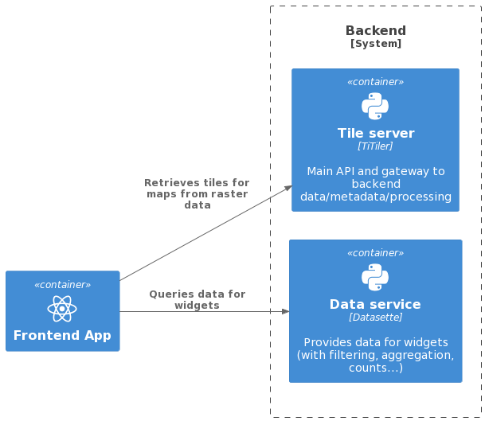

# Foodscapes application - architecture and operational overview

This document describes the current high-level architecture of the cloud
infrastructure for the Foodscapes application.

It also outlines how the application is run/operated, and the deployment
workflow through which it is deployed to live environments such as the
production ("flagship") environment and the staging environment for QA purposes.

## Key principles and operational constraints

From an architectural standpoint, the key principles we follow are:

- Just enough complexity

We aim to balance complex requirements with the goal of keeping implementation
complexity to a suitable minimum.

For example, given the requirements and expected performance envelope for the
application, we identified the
[baked data](https://simonwillison.net/2021/Jul/28/baked-data/) architectural
pattern as a suitable way to colocate data and processing, using SQLite as
backend data layer, without the need to deploy and manage a database server.

- Reliance on open source projects

Wherever possible, we rely on widely adopted open source projects and
components, such as the [NextJS](https://nextjs.org/) framework for the frontend
application, the SQLite-based [Datasette application](https://datasette.io/) to
access data, the
[TiTiler tiler application](https://developmentseed.org/titiler/), and
[OCI/Docker containers](https://www.docker.com/) (simply referred to as
"[OCI containers](https://opencontainers.org/)" in the rest of this document)
for deployment.

Besides the operational leverage, these and other frameworks we choose should
also help both onboard developers to the project, as well as making it easier to
keep the application and its components running with minimal oversight over a
long timespan, relying on commodity cloud services such as AWS Fargate.

## System contexts

With reference to the [C4 model](https://c4model.com/), the current Foodscapes
architecture spans over two public key system contexts as well as two
operational context:

- End users of the application
- The Foodscapes application proper (frontend app and backend services)
- DevOps infrastructure (operational context: supporting services for
  development and deployment)
- Science and engineering teams (operational context)

These are shown here:

## Application components

With reference again to the C4 Model, the Foodscapes application is made up of
three containers (components), which all sit within the _Foodscapes application
proper_ context outlined in the previous section:

- The web application
- The TiTiler tiler application
- The Datasette data API service

Their interaction is shown in the following diagram:

## Operating the Foodscapes platform

The minimalistic architecture of the application outlined above allows to keep
operational requirements to a minimum, while allowing for suitable degrees of
scalability to accommodate peaks in the use of the application.

All the services that make up the application are built as OCI container images
and these are then run on the AWS Fargate serverless, pay-as-you go compute
engine.

The following diagram positions the high-level architecture shown above within
the AWS Fargate service where the services run:

## Deployment workflow

The source code for the Foodscapes application components outlined above as well
as for the application infrastructure (defined as Infrastructure as Code, IaC)
is managed in a single git repository
(https://github.com/Vizzuality/foodscapes).

Live environments of the application (notably, staging and production
environments, as well as any development, QA, etc. environments) are deployed
via CI/CD pipelines that run as GitHub Actions.

The deploment workflow includes two subcomponents:

- infrastructure setup: this includes all the steps required to prepare the AWS
  cloud services needed for the following component
- automated deployment: this is the deployment component proper, which runs each
  time a new change is deployed to a specific environment of the application

Both these components are part of the _DevOps infrastructure_ C4 context
outlined in the [system contexts](#system-contexts) section above.

### Infrastructure setup

The deployment workflow relies on the availability of several systems, such as a
configured and secured AWS Fargate environment as well as other supporting
services.

These systems are created, updated and - when needed, for example if
decommissioning a test environment of the application - deleted through
[Terraform](https://www.terraform.io/).

In broad terms, the Terraform IaC (Infrastructure as Code) setup for the
Foodscapes platform takes care of:

- creating an AWS Elastic Container Registry
- creating the AWS Fargate infrastructure where the live services will be
  deployed
- creating any other cloud services needed to operate the platform (for example,
  networking between application components, firewalls, load balancers, TLS
  certificates, etc.)
- managing the secure configuration of the infrastructure, through the principle
  of least privilege

The cloud infrastructure setup is applied through Terraform when first creating
the infrastructure for a new environment, when needing to update the
configuration of an existing environment (for example, to allow AWS Fargate
services to scale out to a larger number of application instances on the
production environment only, in preparation for expected peaks in the use of the
application) or to decommission an environment.

In general, once the setup is stable throughout the development phase, the
infrastructure setup is seldom updated: it is ready to support the following
component of the deployment workflow.

### Automated deployment

Whenever any of the branches of the git repository that are associated to a live
environment (for example, a `staging` branch with the code that will be deployed
to the staging environment) are updated with new changes/commits/merges, the
following CI/CD steps are run in sequence:

- a GitHub action runs any checks and tests defined for the various application
  components
- a GitHub action builds an OCI container image for each of the application
  services (frontend app, TiTiler, Datasette), baking in any data as needed (see
  the [Data layer section](#data-layer) below for details)
- a GitHub action tags and publishes the freshly built OCI container images to
  the AWS Elastic Container Registry managed through the _Infrastructure setup_
  component described in the previous section

In early phases of development, until the Terraform setup for infrastructure
setup on AWS (see previous section) is completed, images are pushed to GitHub
Container Registry instead, as a way to validate the image build and push step,
as well as to make images available for deployment on local development
environments.

- a GitHub action deploys the new container images to AWS Fargate

Once the last step successfully completes, users will see the latest release of
the application, and will have access through it to the latest version of the
underlying map and widget data.

## Data layer

Data for Foodscapes maps and widgets is managed through lean backend services
hosted on Amazon AWS cloud services.

The [baked data](https://simonwillison.net/2021/Jul/28/baked-data/)
architectural pattern is employed throughout.

### Raster data

Raster data, as a single, multi-band Cloud-Optimized GeoTIFF (COG) file is
included in the OCI container image for the TiTiler tiler service, rather than
being stored on separate cloud storage or in a cloud database.

Colocating raster data and raster computations (aggregation, filtering, etc.)
allows to minimise operational complexity (no further cloud systems need to be
managed) and query latency, as well as to maximise data throughput.

Furthermore, the baked data pattern allows to configure the TiTiler service to
scale out as desired to match peaks in the use of the application, for example
configuring its deployment in AWS Fargate for the production environment to spin
up up to 10 instances, depending on the average load on each instance, with no
additional operational complexity.

### Tabular data for widgets

Tabular data curated for the Foodscapes application is likewise included in the
OCI container image for the Datasette data API service, as a single SQLite
database file.

The Datasette service accepts requests for data and applicable constraints (such
as filtering, faceting, counting, etc.) from the frontend application and
translates them to queries to its embedded SQLite system, eventually returning
to the client app the data that matches the request received.

In order to mitigate risks from queries that may require complex processing
(either accidentally, from application bugs, or maliciously from actors other
than the frontend app), Datasette is configured with a low query timeout
threshold, tuned to be enough for legitimate queries while being low enough to
contain side effects of eccessive use through accidental or malicious activity.

Likewise, as the data is baked as "read-only", there are no risks of accidental
or malicious modification of the data.

As for the TiTiler service, the baked data pattern allows to configure suitable
horizontal scalability profiles for the Datasette service too.
